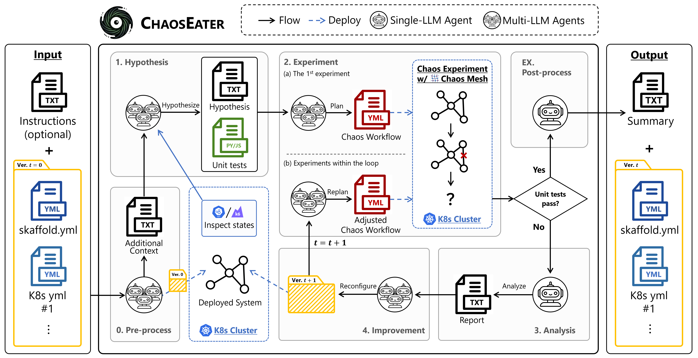
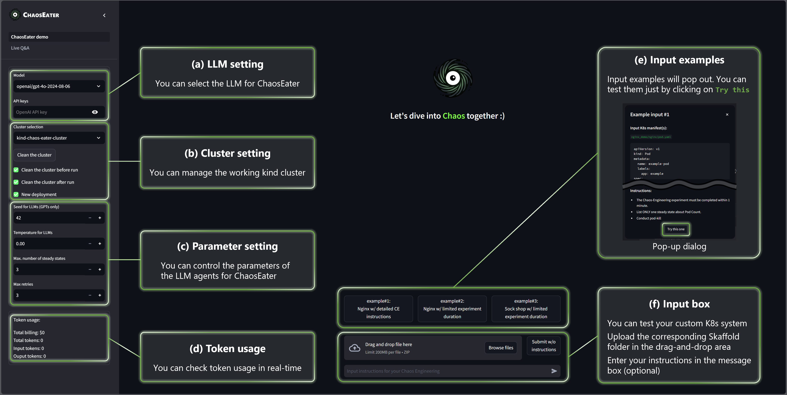

<p align="center" style="text-align:center">
  
  
</p>

# ChaosEater: Fully Automating Chaos Engineering with Large Language Models (ASE 2025, NIER track)

<p align="center">
  <a href="https://ntt-dkiku.github.io/chaos-eater/" target="_blank"></a>
  <a href="https://arxiv.org/abs/2501.11107" target="_blank"></a>
  <a href="https://conf.researchr.org/home/ase-2025" target="_blank"></a>
</p>

<p>
  This repo is the official implementation of 
  
  - <a href="https://arxiv.org/abs/2511.07865" target="_blank">LLM-Powered Fully Automated Chaos Engineering: Towards Enabling Anyone to Build Resilient Software Systems at Low Cost</a> (to appear in ASE 2025, NIER track)
  - <a href="https://arxiv.org/abs/2501.11107" target="_blank">ChaosEater: Fully Automating 
  Chaos Engineering with Large Language Models</a> (extended technical report)
  
  ChaosEater is an LLM-based system that ***fully*** automates the Chaos Engineering (CE) cycle in Kubernetes systems.
  Systematically, a CE cycle consists of four phases: hypothesis, experiment, analysis, and improvement.
  ChaosEater pre-defines its agentic workflow according to the systematic CE cycle and assigns subdivided operations within the workflow into LLM agents.
  These LLM agents autonomously complete the CE cycle through several software engineering tasks, such as requirement definition, test planning, and debugging.
  We hope ChaosEater will serve as a starting point for the full automation of system resilience improvement, which enables **anyone** to build resilient systems **at low cost**.
  Check also the <a href="https://ntt-dkiku.github.io/chaos-eater/" target="_blank">project page</a> and the <a href="https://arxiv.org/abs/2501.11107" target="_blank">technical report</a> for more details.
</p>

> [!WARNING]  
> This system is an experimental implementation and is not ready for product environments.




## 🚀 Quick start
> [!NOTE]  
> In the following, we assume that Docker has been already installed on your machine.  
> FYI: [Official Docker installation guide](https://docs.docker.com/engine/install/ubuntu/)

### 0. Clone this repository
Clone this repository and navigate into the project directory.
```
git clone https://github.com/ntt-dkiku/chaos-eater.git && cd chaos-eater 
```

### 1. Set your API keys in the `.env` file (optional)
Create your .env file and add your API keys.
```
cp docker/.env.example docker/.env
```
> [!TIP]  
> You can also set API keys from the GUI, so this step can be skipped. 
> However, in that case, you will need to enter the keys every time you open the GUI.
> If you prefer not to store your API keys in plain text in the .env file, this may be a better option.

### 2. Launch ChaosEater
Launch ChaosEater with either of the following commands:   

`sandbox` mode (🌟 Recommended for local users 🌟)
```
make setup-sandbox
```
or 
`standard` mode
```
make setup-standard
```
> [!NOTE]  
> We offer two modes for building the ChaosEater app: `sandbox` and `standard` modes.  
> `sandbox` mode containerizes both K8s (kind) clusters and the ChaosEater app. This allows you to easily try out ChaosEater without modifying the host environment, but please use it only in a security-safe environment.  
> In `standard` mode, K8s (kind) clusters and the ChaosEater app's Docker container are built directly on the host.

> [!WARNING]    
> `sandbox` mode uses the privileged option, so it should only be used on your local machine or a securely isolated cloud environment.

### 3. Access the ChaosEater GUI from your browser
Access `localhost:3000` in your browser, and you can try the ChaosEater GUI in your browser!  

> [!TIP]   
> If you edit files inside the `chaos_eater` folder, frontend/backend will automatically restart and apply the changes (i.e., hot reloading is supported). You can also force a restart manually with `make reload`.

> [!TIP]  
> If you are working on a remote server, don't forget to set up port forwarding, e.g., `ssh <remote-server-name> -L 3000:localhost:3000 -L 8000:localhost:8000 -L 2333:localhost:2333`.

### EX1. Stop ChaosEater
Run the following command to stop ChaosEater:
```
make stop
```

### EX2. Test ChaosEater (Experimental)
Run unit tests with the following commands:
```bash
make test          # Run all unit tests
make test-cov      # Run tests with coverage report
```

To run specific tests:
```bash
make test-file FILE=tests/test_api.py           # Run a specific test file
make test-match PATTERN=test_parse              # Run tests matching a pattern
```

> [!TIP]
> To run integration tests that require API keys, create `docker/.env` with your API keys and set `RUN_INTEGRATION_TESTS=1`.

## 🕹️ GUI usage


The ChaosEater app provides a Graphical User Interface (GUI) like a chatbot.
At a minimum, all you need to do is upload the K8s system files via the file uploader.
Optionally, you can enter Chaos Engineering instructions in the chat box and control some parameters.  
The details of the GUI controls are as follows.  

<details>
<summary>
(a) LLM setting
</summary>

> **⚠️WARNING**  
> ChaosEater supports GPT, Gemini, Claude, and local LLMs (Ollama). However, Its behavior may be unstable with models other than GPT-4o. We are currently working to improve stability in the other LLMs.

You may change the LLMs used by ChaosEater from the ```model``` dropdown button.
Preset LLMs include ```openai/gpt-4o-2024-08-06```,```anthropic/claude-3-5-sonnet-20240620```, ```google/gemini-1.5-pro```, ```ollama/qwen3:32b```. If you want to use a different LLM, select ```custom``` and directly enter your preferred LLM in the popup text box. The format should be provider/model_name.
</details>

<details>
<summary>
(b) Cluster setting
</summary>

Currently available clusters are listed in the ```Cluster selection``` dropdown button.
When there are multiple kind clusters, you may change the working kind cluster from here.
While the GUI browser is open, the selected cluster will be occupied, and other users will not see the same cluster in the dropdown button.

If you check ```Clean the cluster before/after run```, all resources in the selected cluster, except for ChaosEater's, will be removed before/after running every single CE cycle.

If you check ```New deployment```, the input K8s system will be deployed in the preprocessing phase. If it is already deployed, you may uncheck it to skip the deployment.

</details>

<details>
<summary>
(c) Parameter setting
</summary>

You can control the parameters of the LLM agents for ChaosEater.  
```Seed for LLMs``` sets the random seed for the LLMs (this is only effective when using OpenAI models that support seed setting, such as GPT-4o).  
```Temperature for LLMs``` sets the temperature of the LLMs.  
```Max. number of steady states``` sets the maximum number of steady states proposed during the hypothesis phase.  
```Max retries``` sets the maximum number of iterations for the verification loop and improvement loop. If the loop exceeds this limit, an assertion error will occur, immediately terminating the app at that point.

</details>

<details>
<summary>
(d) Token usage
</summary>

You can monitor token usage in real-time. The total cost is calculated based on the official pricing tables as of September 2024.  
</details>

<details>
<summary>
(e) Input examples
</summary>

We prepare three types of input examples.
When you press each button, the content of the K8s manifests to be input and the instructions will be displayed in a dialog.
Click the ```Try this one``` button for the example you want to try, and a CE cycle will start for that input example.
</details>

<details>
<summary>
(f) Input box
</summary>

You can try your custom system by inputting its data to the input box.
First, input a zipped folder to the file uploader box following the input format instruction below (this step is mandatory). If you don't have any instructions for the CE cycle, click the ```Submit w/o instructions``` button, and a CE cycle will start for that input system. If you do, write your instructions in the chat box and click the send icon ```▶``` / ```Enter```. Then, a CE cycle that follows the instructions will start for that input system.
</details>

<details>
<summary>
Input format
</summary>

As input, ChaosEater currently supports only a zipped Skaffold project folder, which involves of a Skaffold configuration file and K8s manifests.
The Skaffold configuration file must be placed in the root directory of the folder.
The K8s manifests can be placed anywhere, but ensure that their relative paths are correctly specified in the ```manifests``` section of the Skaffold configuration file.
More specifically, please refer to our example folders: [nginx](./examples/nginx), [sock shop](./examples/sock-shop-2).
</details>

## 💡 Examples (WIP)

### 
<details>
<summary>
  Case A: Nginx
</summary>

#### System description  
Nginx is a small-scale system that consists of two K8s manifests (i.e., two resources): pod.yaml and service.yaml. The former defines a Pod resource including a Nginx container, and the latter defines Service resource routing TCP traffic to the Pod.
You can find the manifests at [examples/nginx](./examples/nginx).

#### Problem setting 
To verify whether ChaosEater can improve the system when there are resiliency issues, we intentionally configure the resource with a non-resilient setting; we set the Pod's restartPolicy to Never in pod.yaml. With this configuration, once the Pod goes down, it will never restart, resulting in extended service outages. we validate whether ChaosEater correctly identifies and addresses this resiliency issue through a reasonable CE cycle.

#### Results  
Given the Nginx, ChaosEater defined "The Pod should be running at least 90% of the time during the check period" as one of the steady states during the hypothesis phase. It then generated a failure scenario for a cyberattack, where the Pod would go down after a network delay.
In the experiment phase, ChaosEater executed the chaos experiment to validate the steady states and successfully discovered that the Pod had not restarted after its failure.

In the analysis and improvement phases, ChaosEater analyzed the results and identified that the issue was caused by the restartPolicy being set to Never. It then replaced the Pod resource with a Deployment resource with three replicas.

Finally, ChaosEater re-executed the chaos experiment on the reconfigured Nginx and confirmed that the hypothesis was satisfied.
The cost and time for this CE cycle were approximately 0.21 USD and 11 minutes, respectively.
</details>

<details>
<summary>
  Case B: SockShop
</summary>

#### System description  
SockShop is a practical and large-scale e-commerce system that consists of 29 manifests, which define the resources and databases for front-end pages, user information, order, payment, shipping, and so on. The number of replicas of all the Deployment resources is originally set to one. However, this setting could lead to downtime of the single replica when it goes down.
You can find the manifests at [examples/sock-shop-2](./examples/sock-shop-2).

#### Problem setting  
To narrow down this original resiliency issue to a single point, we increase the replicas for Deployment resources other than front-end-dep.yaml to two, while keeping a single replica for front-end-dep.yaml. This RELATIVELY reduces the redundancy/resiliency of the front-end resource. We validate whether ChaosEater correctly identifies and addresses this resiliency issue through a reasonable CE cycle.

#### Results  
Given the SockShop with adjusted replica counts, ChaosEater defined "front-end resources are always in the Ready state" as one of the steady states during the hypothesis phase. It then generated a failure scenario for a Black Friday sale, where the front-end resource would go down after an increase in CPU usage of the carts-db resource due to excessive access.
In the experiment phase, ChaosEater executed the chaos experiment to validate the steady states and successfully discovered the existence of downtime after the front-end resource failure.

In the analysis and improvement phases, ChaosEater analyzed the results and identified that the downtime was caused by the replica count of the front-end resource being set to 1. It then increased the replica count of the front-end resource to 2.

Finally, ChaosEater re-executed the chaos experiment on the reconfigured SockShop and confirmed that the hypothesis was satisfied.
The cost and time for this CE cycle were approximately 0.84 USD and 25 minutes, respectively.
</details>

<details>
<summary>
  Case C: OnlineBoutique (WIP)
</summary>

Coming soon!
</details>

## 📊 Evaluation
> [!WARNING]
> Due to the nondeterministic nature of LLMs, datasets and evaluation results may vary between runs, even when a seed value is set.

### Common Options
The following options are shared across all evaluation commands:

| Option | Default | Description |
|--------|---------|-------------|
| `EVAL_MODEL` | `openai/gpt-4o-2024-08-06` | LLM model for ChaosEater |
| `EVAL_SAMPLES` | `5` | Number of ChaosEater runs per sample |
| `EVAL_REVIEWS` | `5` | Number of reviews per reviewer |
| `EVAL_TEMPERATURE` | `0.0` | LLM temperature |
| `EVAL_SEED` | `42` | Random seed for LLMs |
| `EVAL_PORT` | `8000` | vLLM server port |
| `EVAL_REVIEWERS` | `all` | Comma-separated reviewers or `all` |

### 1. ASE Paper Evaluation
#### 1.1. Run Experiments
> [!NOTE]
> Our results are already saved in `evaluation/ase2025/results`, so you can skip this step if you only want to reproduce the tables and graphs from the paper.

Run the following command to replicate the experiments from the ASE paper:
```bash
make eval-ase2025
```

**ASE2025-specific options:**

| Option | Default | Description |
|--------|---------|-------------|
| `ASE_OUTPUT_DIR` | `evaluation/ase2025/results` | Output directory |
| `ASE_SYSTEMS` | `all` | Systems to evaluate (`nginx`, `sockshop`, or `all`) |

#### 1.2. Reproduce the Tables and Graphs
After the experiments are complete, open Jupyter Lab with:
```bash
make open-jupyter
```
Then navigate to `evaluation/ase2025/analyze_evaluation_result.ipynb` to reproduce the tables and graphs.

### 2. Synthetic Data Evaluation
Evaluate ChaosEater on synthetically generated K8s manifests:
```bash
make eval-synth
```

To generate synthetic data only (without running ChaosEater or reviews):
```bash
make gen-synth-data
```

**Synthetic-specific options:**

| Option | Default | Description |
|--------|---------|-------------|
| `SYNTH_DATA_DIR` | `evaluation/synthetic/data` | Directory for synthetic data |
| `SYNTH_OUTPUT_DIR` | `evaluation/synthetic/results` | Output directory for results |
| `SYNTH_NUM_SAMPLES` | `5` | Number of data samples to generate |
| `SYNTH_MANIFESTS` | `1 2 3` | Number of K8s manifests per sample |
| `SYNTH_DATA_TYPE` | `weak` | Dataset type (`normal` or `weak`) |
| `SYNTH_EXP_TIME` | `1` | CE experiment time limit (minutes) |

**Example usage:**
```bash
# Quick test with minimal samples
make eval-synth SYNTH_NUM_SAMPLES=1 EVAL_SAMPLES=1 SYNTH_MANIFESTS="1"

# Full evaluation with custom settings
make eval-synth EVAL_MODEL=openai/gpt-4o-2024-08-06 SYNTH_NUM_SAMPLES=5 EVAL_SAMPLES=3
```


## 🐞 Bug report and questions
If you encounter bugs or have any questions, please post [issues](https://github.com/ntt-dkiku/chaos-eater/issues) or [discussions](https://github.com/ntt-dkiku/chaos-eater/discussions) in this repo. New feature requests are also welcome.

## 📄 License
Our code is licensed by NTT. The use of our code is limited to research purposes. See [LICENSE](./LICENSE.md) for details.

## 🙌 Acknowledgements
ChaosEater is built upon numerous excellent projects. Big thank you to the following projects! (A-Z):
- LLM:
  - [Anthropic API](https://www.anthropic.com/api)
  - [Gemini API](https://ai.google.dev/)
  - [LangChain](https://github.com/langchain-ai/langchain)
  - [Ollama](https://github.com/ollama/ollama)
  - [OpenAI API](https://openai.com/index/openai-api/)
- K8s/CE tool:
  - [Chaos Mesh](https://github.com/chaos-mesh/chaos-mesh)
  - [Docker](https://github.com/docker)
  - [k6](https://github.com/grafana/k6)
  - [kind](https://github.com/kubernetes-sigs/kind)
  - [Kubernetes](https://github.com/kubernetes/kubernetes)
  - [Skaffold](https://github.com/GoogleContainerTools/skaffold)
- Application:
  - [FastAPI](https://github.com/fastapi/fastapi)
  - [React](https://github.com/facebook/react)
- All other related projects

## 🤝 Citation
If you find this work useful, please cite our paper as follows:
```
@misc{dkiku2025chaoseater,
    title={ChaosEater: Fully Automating Chaos Engineering with Large Language Models}, 
    author={Daisuke Kikuta and Hiroki Ikeuchi and Kengo Tajiri},
    year={2025},
    eprint={2501.11107},
    archivePrefix={arXiv},
    primaryClass={cs.SE},
    url={https://arxiv.org/abs/2501.11107}, 
}
```
